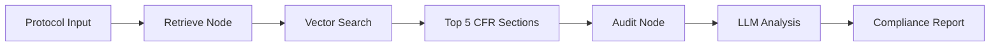

# Regulatory Intelligence Platform (RIP)

A multi-modal agentic platform built for the MedGemma Impact Challenge. It automates the "Regulatory Cross-Examination" of clinical trial protocols, ensuring alignment with **21 CFR Part 11** and global ethical standards before a single patient is enrolled.

## 🎯 Overview

**RIP** tackles the unsexy but critical bottleneck in clinical trials: regulatory compliance checking. By combining Retrieval-Augmented Generation (RAG) with LangGraph's agentic workflow, RIP automates the cross-examination of clinical trial protocols against FDA regulations, freeing researchers to focus on innovation rather than grunt work.

## 🧠 Architecture

The platform uses a **two-node agentic workflow**:
1. **Retrieval Node**: Searches 21 CFR Part 11 regulations for sections relevant to the protocol text
2. **Audit Node**: Uses Google Gemini (or MedGemma) to perform regulatory cross-examination

```
User Input (Protocol) → Retrieve Regulations → Audit Against Regulations → Compliance Report
```

## 🚀 Quick Start

### Prerequisites

- Python 3.8+
- Google Cloud Project with Vertex AI API enabled
- API credentials configured

### Installation

```bash
# Clone the repository
git clone https://github.com/Once28/Regulatory-Intelligence-Platform.git
cd Regulatory-Intelligence-Platform

# Install dependencies
pip install -r requirements.txt

# Set up environment variables
cp .env.example .env
# Edit .env with your Google Cloud credentials
```

### Running the Application

```bash
streamlit run app.py
```

The web interface will open at `http://localhost:8501`

## 📁 Directory Guide

```
Regulatory-Intelligence-Platform/
├── app.py                  # Streamlit web interface
├── graph.py                # LangGraph workflow definition
├── nodes.py                # Retrieval and audit node implementations
├── state.py                # Agent state schema (TypedDict)
├── prompts.py              # System prompts for FDA auditor persona
├── ecfr_client.py          # eCFR API client for fetching 21 CFR Part 11
├── vector_store.py         # ChromaDB RAG initialization
├── requirements.txt        # Python dependencies
├── README.md               # This file
├── WRITEUP.md              # MedGemma Impact Challenge submission
├── data/
│   └── chroma_db/          # Persistent vector database
└── test/
    ├── pipeline.ipynb      # Development testing notebook
    └── medgamma.ipynb      # MedGemma integration experiments
```

## 🔧 Core Components

### 1. **app.py** - Main Application
- Streamlit web UI
- Fetches 21 CFR Part 11 via eCFR API
- Initializes RAG system and LLM
- Orchestrates the audit workflow

### 2. **graph.py** - Workflow Engine
- Defines LangGraph state machine
- Connects retrieval → audit nodes
- Compiles executable graph

### 3. **nodes.py** - Processing Nodes
- **retrieval_node**: Queries vector store for relevant regulations
- **audit_node**: Performs LLM-based regulatory analysis

### 4. **state.py** - State Management
```python
AgentState:
  - protocol_text: str              # Input protocol section
  - retrieved_regulations: List[str] # Relevant CFR sections
  - audit_results: str               # Compliance analysis
  - compliance_score: int            # 1-100 score (future)
```

### 5. **ecfr_client.py** - Regulatory Data
- Fetches live 21 CFR Part 11 from eCFR.gov API
- Ensures up-to-date regulatory text

### 6. **vector_store.py** - RAG System
- ChromaDB for persistent vector storage
- HuggingFace embeddings (sentence-transformers)
- Returns top 5 relevant regulation chunks

### 7. **prompts.py** - Prompt Engineering
- FDA Regulatory Auditor persona
- Structured instructions for compliance checking
- Focus on electronic signatures and audit trails

## 🔬 Technology Stack

| Component | Technology |
|-----------|-----------|
| **Workflow Engine** | LangGraph 0.2+ |
| **LLM Framework** | LangChain 0.3+ |
| **LLM Model** | Google Gemini 1.5 Flash / MedGemma (HAI-DEF) |
| **Vector Database** | ChromaDB 0.5+ |
| **Embeddings** | HuggingFace sentence-transformers |
| **Web Interface** | Streamlit 1.40+ |
| **Regulatory API** | eCFR.gov XML API |

## 🎓 How It Works

1. **User inputs** a clinical trial protocol section via Streamlit
2. **eCFR Client** fetches the latest 21 CFR Part 11 regulations
3. **Vector Store** chunks and embeds regulations for semantic search
4. **Retrieval Node** finds the 5 most relevant regulation sections
5. **Audit Node** uses Gemini/MedGemma to cross-examine protocol against regulations
6. **Output**: Compliance findings with red zone risks highlighted

## 🛠️ Current Workflow



## 📋 To-Do List

- [ ] Integrate MedGemma via Vertex AI endpoint
- [ ] Add compliance scoring system (1-100)
- [ ] Implement multi-file protocol upload
- [ ] Expand to ICH-GCP and EMA guidelines
- [ ] Add citation tracking for regulation references
- [ ] Build audit trail export (PDF/CSV)
- [ ] Create admin dashboard for batch processing
- [ ] Unit tests for retrieval and audit nodes
- [ ] Deployment via Cloud Run / Docker

## 👥 Team

- **Justin Zeng** - Data Scientist with Medical Specialty
- **Kennard Mah** - Data Scientist

## 📄 License

This project is built for the MedGemma Impact Challenge.

## 🤝 Contributing

Contributions are welcome! Please open an issue or submit a pull request.

## 📞 Contact

For questions about this project, please refer to [WRITEUP.md](WRITEUP.md) for technical documentation used for MedGamme submission.

