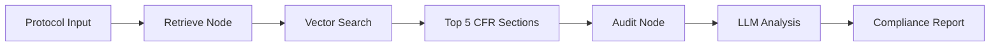

# Regulatory Intelligence Platform (RIP)

A multi-modal agentic platform built for the MedGemma Impact Challenge. It automates the "Regulatory Cross-Examination" of clinical trial protocols, ensuring alignment with **21 CFR Part 11** and global ethical standards before a single patient is enrolled.

**RIP** tackles the critical bottleneck in clinical trials: regulatory compliance checking. By combining Retrieval-Augmented Generation (RAG) with LangGraph's agentic workflow, RIP automates the cross-examination of clinical trial protocols against FDA regulations, freeing researchers to focus on innovation rather than grunt work.

## Architecture

The platform uses a **two-node agentic workflow**:
1. **Retrieval Node**: Searches 21 CFR Part 11 regulations for sections relevant to the protocol text
2. **Audit Node**: Uses Google Gemini (or MedGemma) to perform regulatory cross-examination

```
User Input (Protocol) → Retrieve Regulations → Audit Against Regulations → Compliance Report
```

## Getting Started

### Prerequisites

- Python 3.8+
- Google Cloud Project with Vertex AI API enabled
- API credentials configured

### Installation

```bash
# clone repo
git clone https://github.com/Once28/Regulatory-Intelligence-Platform.git
cd Regulatory-Intelligence-Platform
# virtual environment
conda create -n rip_env python=3.10 # to create
conda activate rip_env # to activate
# install requirements
pip install -r requirements.txt
# cp .env.example .env
# .env with your Google Cloud credentials
```

### Running the Application
```bash
streamlit run app.py
```

The web interface will open at `http://localhost:8501`

## 📁 Directory Guide

```
Regulatory-Intelligence-Platform/
├── app.py                  # Streamlit web interface
├── graph.py                # LangGraph workflow definition
├── nodes.py                # Retrieval and audit node implementations
├── state.py                # Agent state schema (TypedDict)
├── prompts.py              # System prompts for FDA auditor persona
├── ecfr_client.py          # eCFR API client for fetching 21 CFR Part 11
├── vector_store.py         # ChromaDB RAG initialization
├── requirements.txt        # Python dependencies
├── README.md               # This file
├── WRITEUP.md              # MedGemma Impact Challenge submission
├── data/
│   └── chroma_db/          # Persistent vector database
└── test/
    ├── pipeline.ipynb      # Development testing notebook
    └── medgamma.ipynb      # MedGemma integration experiments
```

## 🔧 Core Components

### 1. **app.py** - Main Application
- Streamlit web UI
- Fetches 21 CFR Part 11 via eCFR API
- Initializes RAG system and LLM
- Orchestrates the audit workflow

### 2. **graph.py** - Workflow Engine
- Defines LangGraph state machine
- Connects retrieval → audit nodes
- Compiles executable graph

### 3. **nodes.py** - Processing Nodes
- **retrieval_node**: Queries vector store for relevant regulations
- **audit_node**: Performs LLM-based regulatory analysis

### 4. **state.py** - State Management
```python
AgentState:
  - protocol_text: str              # Input protocol section
  - retrieved_regulations: List[str] # Relevant CFR sections
  - audit_results: str               # Compliance analysis
  - compliance_score: int            # 1-100 score (future)
```

### 5. **ecfr_client.py** - Regulatory Data
- Fetches live 21 CFR Part 11 from eCFR.gov API
- Ensures up-to-date regulatory text

### 6. **vector_store.py** - RAG System
- ChromaDB for persistent vector storage
- HuggingFace embeddings (sentence-transformers)
- Returns top 5 relevant regulation chunks

### 7. **prompts.py** - Prompt Engineering
- FDA Regulatory Auditor persona
- Structured instructions for compliance checking
- Focus on electronic signatures and audit trails

## 🔬 Technology Stack

| Component | Technology |
|-----------|-----------|
| **Workflow Engine** | LangGraph 0.2+ |
| **LLM Framework** | LangChain 0.3+ |
| **LLM Model** | Google Gemini 1.5 Flash / MedGemma (HAI-DEF) |
| **Vector Database** | ChromaDB 0.5+ |
| **Embeddings** | HuggingFace sentence-transformers |
| **Web Interface** | Streamlit 1.40+ |
| **Regulatory API** | eCFR.gov XML API |

## 🎓 How It Works

1. **User inputs** a clinical trial protocol section via Streamlit
2. **eCFR Client** fetches the latest 21 CFR Part 11 regulations
3. **Vector Store** chunks and embeds regulations for semantic search
4. **Retrieval Node** finds the 5 most relevant regulation sections
5. **Audit Node** uses Gemini/MedGemma to cross-examine protocol against regulations
6. **Output**: Compliance findings with red zone risks highlighted

## 🛠️ Current Workflow



## 📄 License

This project is built for the MedGemma Impact Challenge. Contributions are welcome! Please open an issue or submit a pull request. For questions about this project, please refer to [WRITEUP.md](WRITEUP.md) for technical documentation used for MedGamme submission.

---

# RIP System DAG

The Regulatory Intelligence Platform (RIP) is structured as a DAG with five logical layers: external data sources, ingestion and transformation, an ontology-backed retrieval layer, agentic processing, and output artifacts. Each node below maps to a specific Python module and model.


## DAG Diagram

```
┌─────────────────────────────────────────────────────────────────────────────┐
│  DATA SOURCES (External)                                                    │
│                                                                             │
│   ┌──────────────────┐          ┌──────────────────────┐                    │
│   │ A  eCFR.gov API  │          │ B  User Protocol     │                    │
│   │    (21 CFR §11)  │          │    (Free-text input)  │                    │
│   └────────┬─────────┘          └──────────┬───────────┘                    │
└────────────│────────────────────────────────│────────────────────────────────┘
             │ HTTP GET (XML)                 │ Streamlit text_area
             ▼                                │
┌─────────────────────────────────┐           │
│  INGESTION & TRANSFORMATION     │           │
│                                 │           │
│   ┌─────────────────────────┐   │           │
│   │ C  XML Parsing &        │   │           │
│   │    Text Extraction      │   │           │
│   │    ························  │           │
│   │    file: ecfr_client.py │   │           │
│   └────────┬────────────────┘   │           │
│            │ raw law text (str) │           │
│            ▼                    │           │
│   ┌─────────────────────────┐   │           │
│   │ D  Recursive Chunking   │   │           │
│   │    (800 chars, 80 overlap)  │           │
│   │    ························  │           │
│   │    file: vector_store.py│   │           │
│   └────────┬────────────────┘   │           │
│            │ List[Document]     │           │
│            ▼                    │           │
│   ┌─────────────────────────┐   │           │
│   │ E  Embedding            │   │           │
│   │    ························  │           │
│   │    model: all-MiniLM-   │   │           │
│   │           L6-v2         │   │           │
│   │    file: vector_store.py│   │           │
│   └────────┬────────────────┘   │           │
│            │ vector embeddings  │           │
└────────────│────────────────────┘           │
             ▼                                │
┌──────────────────────────────────────┐      │
│  ONTOLOGY LAYER (Vector Store)       │      │
│                                      │      │
│   ┌──────────────────────────────┐   │      │
│   │ F  ChromaDB                  │   │      │
│   │    (Persistent Store)        │   │      │
│   │    ·····························  │      │
│   │    dir:  data/chroma_db/     │   │      │
│   │    file: vector_store.py     │   │      │
│   │                              │   │      │
│   │  ┌────────────────────────┐  │   │      │
│   │  │ ONTOLOGY SCHEMA        │  │   │      │
│   │  │                        │  │   │      │
│   │  │  Entities:             │  │   │      │
│   │  │   • CFR Subpart        │  │   │      │
│   │  │   • Section (§11.xx)   │  │   │      │
│   │  │   • Requirement        │  │   │      │
│   │  │                        │  │   │      │
│   │  │  Relations:            │  │   │      │
│   │  │   • subpart ──has──▶   │  │   │      │
│   │  │       section          │  │   │      │
│   │  │   • section ──mandates─│  │   │      │
│   │  │       ──▶ requirement  │  │   │      │
│   │  │                        │  │   │      │
│   │  │  Domains:              │  │   │      │
│   │  │   • Electronic Records │  │   │      │
│   │  │   • Electronic Sigs    │  │   │      │
│   │  │   • Audit Trails       │  │   │      │
│   │  │   • System Controls    │  │   │      │
│   │  └────────────────────────┘  │   │      │
│   └──────────┬───────────────────┘   │      │
│              │                       │      │
└──────────────│───────────────────────┘      │
               │ retriever (k=5)              │
               ▼                              ▼
┌─────────────────────────────────────────────────────────────────────────────┐
│  AGENTIC PROCESSING (LangGraph State Machine)                               │
│  file: graph.py  ·  state schema: state.py                                  │
│                                                                             │
│  ┌─────────────────────────┐     ┌──────────────────────────────────┐       │
│  │ G  RETRIEVAL NODE       │────▶│ H  AUDIT NODE                    │       │
│  │    (entry point)        │     │    (terminal node → END)         │       │
│  │    ·······················     │    ·······························│       │
│  │    file: nodes.py       │     │    file: nodes.py                │       │
│  │          retrieval_node │     │          audit_node              │       │
│  │                         │     │                                  │       │
│  │  Inputs:                │     │  Inputs:                         │       │
│  │   • protocol_text (B)   │     │   • retrieved_regulations (G)    │       │
│  │   • retriever    (F)    │     │   • protocol_text          (B)   │       │
│  │                         │     │                                  │       │
│  │  Operation:             │     │  Operation:                      │       │
│  │   Semantic similarity   │     │   Prompt construction via        │       │
│  │   search over ChromaDB  │     │   AUDIT_PROMPT template          │       │
│  │                         │     │   (file: prompts.py), then       │       │
│  │  Output:                │     │   LLM inference                  │       │
│  │   retrieved_regulations │     │                                  │       │
│  │   (List[str], top 5)    │     │  Model:                          │       │
│  │                         │     │   Gemini 1.5 Flash (current)     │       │
│  │                         │     │   → MedGemma 27B (planned)       │       │
│  │                         │     │                                  │       │
│  │                         │     │  Output:                         │       │
│  │                         │     │   audit_results (str)            │       │
│  └─────────────────────────┘     └───────────────┬──────────────────┘       │
│                                                  │                          │
│  State Object (AgentState, file: state.py):                                 │
│  ┌──────────────────────────────────────────────────────────┐               │
│  │  protocol_text: str            # from node B             │               │
│  │  retrieved_regulations: List[str]  # set by node G       │               │
│  │  audit_results: str            # set by node H           │               │
│  │  compliance_score: int         # unused (planned)        │               │
│  └──────────────────────────────────────────────────────────┘               │
└──────────────────────────────────────────────────│──────────────────────────┘
                                                   │
                                                   ▼
┌─────────────────────────────────────────────────────────────────────────────┐
│  OUTPUT ARTIFACTS                                                           │
│  file: app.py (Streamlit rendering)                                         │
│                                                                             │
│   ┌──────────────────────────┐   ┌───────────────────────────────┐          │
│   │ I  Compliance Report     │   │ J  Retrieved Regulations      │          │
│   │    (st.markdown)         │   │    (st.expander → st.info)    │          │
│   │    ·······················   │    ····························│          │
│   │    Content:              │   │    Content:                    │          │
│   │     • Red Zone risks     │   │     • Top 5 CFR §11 chunks    │          │
│   │     • Missing controls   │   │     • Verbatim regulation     │          │
│   │     • Recommendations    │   │       text for traceability   │          │
│   └──────────────────────────┘   └───────────────────────────────┘          │
│                                                                             │
│   ┌──────────────────────────┐                                              │
│   │ K  Compliance Score      │                                              │
│   │    (PLANNED, not yet     │                                              │
│   │     implemented)         │                                              │
│   │    ·······················                                              │
│   │    Range: 1–100          │                                              │
│   └──────────────────────────┘                                              │
└─────────────────────────────────────────────────────────────────────────────┘
```

---

## Node Reference

### Data Sources

| Node | Role | File / Source | Output |
|------|------|---------------|--------|
| **A** | Live regulatory data from the U.S. Electronic Code of Federal Regulations. Provides the authoritative text of 21 CFR Part 11 (electronic records and signatures). | `ecfr_client.py` → `https://ecfr.gov` | Raw XML string |
| **B** | User-supplied clinical trial protocol section. Free-text input via the Streamlit UI. This is the document under audit. | `app.py` (Streamlit `text_area`) | `protocol_text: str` |

### Ingestion & Transformation

| Node | Role | File / Model | Input → Output |
|------|------|--------------|----------------|
| **C** | Fetches and extracts raw text from the eCFR XML response. Acts as the data ingestion boundary. | `ecfr_client.py` · `ECFRClient.get_part_11_text()` | HTTP response → `raw_law_text: str` |
| **D** | Splits the monolithic regulation text into semantically coherent chunks using recursive character splitting (800-char windows, 80-char overlap). This chunking strategy preserves paragraph-level regulatory meaning. | `vector_store.py` · `RecursiveCharacterTextSplitter` | `str` → `List[Document]` |
| **E** | Encodes each text chunk into a 384-dimensional dense vector for semantic search. | `vector_store.py` · **Model: `sentence-transformers/all-MiniLM-L6-v2`** | `List[Document]` → vector embeddings |

### Ontology Layer

| Node | Role | File / Storage | Details |
|------|------|----------------|---------|
| **F** | Persistent vector database that serves as the system's **ontology store**. It encodes the regulatory knowledge graph implicitly: each embedded chunk represents a regulatory requirement, and semantic proximity defines relationships between requirements. | `vector_store.py` · **ChromaDB** · `data/chroma_db/` | See ontology schema below |

**Ontology definition and usage:**

The ontology is an *implicit semantic ontology* over 21 CFR Part 11, structured as follows:

- **Entities** are regulatory text chunks, each representing a requirement or set of requirements from a specific CFR section (e.g., §11.10 Controls for closed systems, §11.50 Signature manifestations).
- **Relations** are encoded as vector proximity — chunks that are semantically related (e.g., two sections both addressing audit trail requirements) are near neighbors in embedding space.
- **Domains** covered: Electronic Records, Electronic Signatures, Audit Trails, System Validation, and Access Controls.
- **Usage**: When the retrieval node receives a protocol snippet, the ontology is queried via cosine similarity to surface the **top 5 most relevant regulatory requirements**. This grounds the audit node's analysis in specific, traceable regulation text rather than relying on the LLM's parametric memory alone.

### Agentic Processing

| Node | Role | File / Model | Input → Output |
|------|------|--------------|----------------|
| **G** | **Retrieval Node** — entry point of the LangGraph state machine. Performs semantic search against the ontology layer to find the regulatory sections most relevant to the user's protocol text. | `nodes.py` · `retrieval_node()` · `graph.py` (wired as entry point) | `protocol_text` → `retrieved_regulations: List[str]` (top 5 chunks) |
| **H** | **Audit Node** — terminal processing node. Constructs a prompt from the AUDIT_PROMPT template (`prompts.py`), injecting retrieved regulations as context and the protocol as the subject of review. Invokes the LLM for regulatory cross-examination. | `nodes.py` · `audit_node()` · `prompts.py` · **Model: Gemini 1.5 Flash** (planned: **MedGemma 27B**) | `(retrieved_regulations, protocol_text)` → `audit_results: str` |

**Edge definitions in `graph.py`:**
```
ENTRY → G (retrieve) → H (audit) → END
```

### Output Artifacts

| Node | Role | File | Content |
|------|------|------|---------|
| **I** | Primary deliverable. Rendered as Markdown in the Streamlit UI. Contains Red Zone risk flags, missing compliance controls, and regulatory recommendations. | `app.py` · `st.markdown()` | `audit_results` |
| **J** | Transparency artifact. Shows the exact regulation chunks that informed the audit, enabling traceability and human verification. | `app.py` · `st.expander()` | `retrieved_regulations` |
| **K** | *(Planned)* Numeric compliance score (1–100) with severity banding. Defined in state schema but not yet populated by any node. | `state.py` (field defined) | `compliance_score: int` |

---

## Data Flow Summary

```
A (eCFR API) ──XML──▶ C (parse) ──str──▶ D (chunk) ──docs──▶ E (embed) ──vectors──▶ F (ChromaDB)
                                                                                        │
B (User Input) ─────────────────────────────────┬───────────────────────────────────────│
                                                │                                       │
                                                ▼                                       ▼
                                          G (Retrieve) ◀── semantic search ──── F (ChromaDB)
                                                │
                                                │ retrieved_regulations
                                                ▼
                                          H (Audit) ◀── AUDIT_PROMPT (prompts.py)
                                                │         + Gemini / MedGemma
                                                │
                                    ┌───────────┼───────────┐
                                    ▼           ▼           ▼
                                I (Report)  J (Regs)   K (Score)
                                                       [planned]
```

---

## File-to-Node Mapping

| File | Nodes Involved | Responsibility |
|------|---------------|----------------|
| `ecfr_client.py` | A, C | Data source access and XML text extraction |
| `vector_store.py` | D, E, F | Chunking, embedding, and vector store initialization |
| `nodes.py` | G, H | Core retrieval and audit logic |
| `graph.py` | G → H (wiring) | LangGraph DAG definition and compilation |
| `state.py` | All agentic nodes | Shared state schema (`AgentState` TypedDict) |
| `prompts.py` | H | Audit prompt template with FDA auditor persona |
| `app.py` | B, I, J | UI layer — input collection and output rendering |

## Model-to-Node Mapping

| Model | Node | Purpose |
|-------|------|---------|
| `all-MiniLM-L6-v2` (HuggingFace) | E | Text → 384-dim vector embeddings for semantic search |
| `gemini-1.5-flash` (Google) | H | Regulatory cross-examination and report generation |
| `medgemma-27b` *(planned)* | H | Domain-specific clinical and regulatory reasoning |
